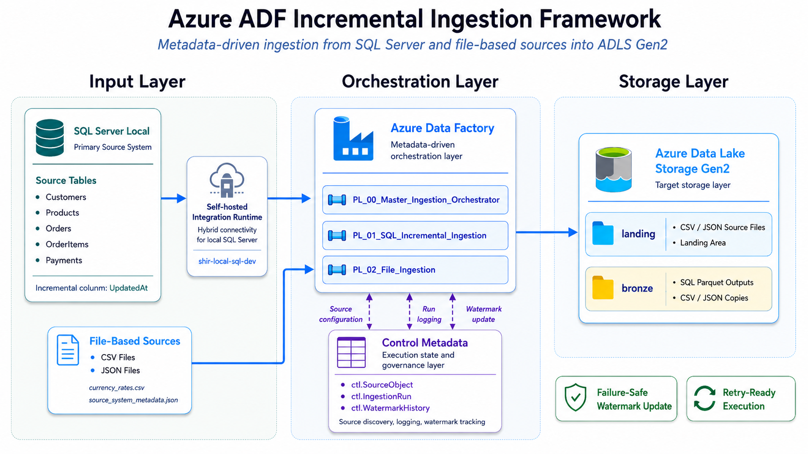

# Azure ADF Incremental Ingestion Framework

## Overview

`azure-adf-incremental-ingestion-framework` is a portfolio-oriented Azure Data Engineering project that demonstrates a metadata-driven incremental ingestion framework using Azure Data Factory, SQL Server, Azure Data Lake Storage Gen2, control tables, watermarks, and operational validation evidence.

The project ingests data from:

* Local SQL Server tables
* CSV files
* JSON files

and lands the data into Azure Data Lake Storage Gen2 using reusable pipelines, dynamic datasets, control metadata, and validated failure-safe behavior.

This is not a simple one-off copy demo.
The goal is to demonstrate a practical ingestion framework pattern similar to what data engineering teams use in real-world batch ingestion workflows.

---

## Architecture Summary

The project follows a three-layer architecture designed to separate source systems, pipeline orchestration, and lake storage responsibilities:


* **Input Layer**
* **Orchestration Layer**
* **Storage Layer** 



A control metadata layer supports the orchestration process by driving source discovery, routing, execution logging, watermark tracking, and retry-safe behavior.

---

## Main Components

| Component | Purpose |
|-----------|----------|
| SQL Server Local | Primary source system and control metadata store.|
| Azure Data Factory | Orchestrates SQL and file ingestion pipelines. | 
| Self-hosted Integration Runtime | Enables ADF to connect to local SQL Server. |
| Azure Data Lake Storage Gen2 | Stores landed SQL, CSV, and JSON outputs. |
| Control Tables | Store source configuration, run history, and watermark state. |
| Dynamic Datasets | Enable reusable source and target definitions. |
| Stored Procedures | Provide the ADF interface to control metadata. |

---

## Key Features

* Metadata-driven ingestion
* SQL Server incremental loading
* Datetime-based watermark strategy
* CSV and JSON file ingestion
* Master/child ADF pipeline design
* Dynamic datasets
* Dynamic ADLS Gen2 output paths
* Control table logging
* Watermark history
* Failure-safe behavior
* Retry after failure validation
* Evidence-based documentation
* Public-safe scripts and sample data

---

## Azure Data Factory Pipelines

| Pipeline | Purpose |
|----------|---------|
| `PL_00_Master_Ingestion_Orchestrator` | Reads active source objects and routes execution to SQL or file ingestion pipelines. |
| `PL_01_SQL_Incremental_Ingestion` | Extracts SQL Server rows incrementally using `UpdatedAt` watermarks and writes Parquet to ADLS Gen2. |
| `PL_02_File_Ingestion` | Copies CSV and JSON files from ADLS `landing` to ADLS `bronze`. |

---

## Source Systems

### SQL Server Tables

The SQL Server source model uses a sales order processing domain.

Tables:

```text
dbo.Customers
dbo.Products
dbo.Orders
dbo.OrderItems
dbo.Payments
```

Each source table includes:

```text
CreatedAt
UpdatedAt
```

The framework uses `UpdatedAt` as the watermark column.

---

### File Sources

The file ingestion pipeline supports:

```text
CSV_FILE
JSON_FILE
```

Sample files:

```text
currency_rates.csv
country_currency.csv
source_system_metadata.json
manual_adjustments.json
```

---

## Target Storage

The project uses Azure Data Lake Storage Gen2.

Containers:

```text
landing
bronze
rejected
metadata
evidence
```

SQL outputs are written as Parquet under:

```text
bronze/sqlserver/<source_system>/<schema>/<table>/load_date=YYYY-MM-DD/run_id=<run_id>/<table>.parquet
```

File outputs are copied under:

```text
bronze/files/<format>/<source_object>/load_date=YYYY-MM-DD/run_id=<run_id>/<file_name>
```

---

## Watermark Strategy

The SQL ingestion framework uses this extraction window:

```sql
WHERE UpdatedAt > @LastWatermarkValue
  AND UpdatedAt <= @CurrentHighWatermarkValue
```

The lower bound is exclusive to avoid reprocessing rows already captured by previous successful runs.

The upper bound is inclusive to capture all rows up to the high watermark recorded before the copy starts.

Core rule:

```text
The stored watermark is updated only after a successful copy.
```

If a run fails:

* The run is logged as `Failed`
* The watermark does not advance
* No watermark history is inserted
* Pending source rows remain eligible for retry

---

## Operational Scenarios Validated

| Scenario | Result |
|----------|--------|
| SQL incremental ingestion | Passed |
| CSV file ingestion | Passed |
| JSON file ingestion | Passed |
| Master orchestrator file routing | Passed |
| Master orchestrator SQL routing | Passed |
| Incremental insert | Passed |
| Incremental update | Passed |
| Refund scenario | Passed |
| Empty run validation | Passed |
| Controlled failed run | Passed |
| Retry after failure | Passed |
| Final operational validation summary | Passed |

---

## Evidence

Selected evidence screenshots are included under:

```text
docs/evidence/screenshots/
```

Evidence index:

```text
docs/evidence/evidence_index.md
```

Important evidence includes:

| Evidence                                             | What It Proves                                   |
| ---------------------------------------------------- | ------------------------------------------------ |
| `48_sql_copy_to_adls_success.png`                    | SQL Server data copied to ADLS Gen2 as Parquet.  |
| `49_sql_pipeline_complete_and_watermark_success.png` | SQL pipeline completed and watermark advanced.   |
| `51_file_pipeline_csv_copy_and_control_success.png`  | CSV file ingestion succeeded.                    |
| `52_file_pipeline_json_copy_and_control_success.png` | JSON file ingestion succeeded.                   |
| `53_master_orchestrator_files_success.png`           | Master orchestrator routed file sources.         |
| `54_master_orchestrator_sql_success.png`             | Master orchestrator routed SQL sources.          |
| `57_incremental_insert_ingestion_success.png`        | Incremental insert scenario succeeded.           |
| `59_incremental_update_ingestion_success.png`        | Incremental update scenario succeeded.           |
| `61_refund_ingestion_success.png`                    | Refund scenario succeeded.                       |
| `64_controlled_failed_run_validation.png`            | Failed run did not advance watermark.            |
| `65_retry_after_failure_success.png`                 | Retry after failure succeeded.                   |
| `66_operational_validation_final_summary.png`        | Final validation summary across major scenarios. |

---

## Repository Structure

```text
.
├── README.md
├── LICENSE
├── docs/
│   ├── architecture/
│   ├── implementation/
│   ├── operations/
│   ├── evidence/
│   ├── certification_alignment.md
│   └── known_limitations_and_future_improvements.md
├── diagrams/
├── sql/
│   ├── ddl/
│   ├── dml/
│   ├── stored-procedures/
│   ├── validation-queries/
│   └── test-scenarios/
├── sample-data/
│   ├── csv/
│   └── json/
├── scripts/
│   ├── azure/
│   └── cleanup/
└── adf/
```

---

## Documentation

### Architecture

| Document | Purpose |
|----------|---------|
| [`docs/architecture/architecture_overview.md`](docs/architecture/architecture_overview.md) | High-level architecture and main components. |
| [`docs/architecture/adf_pipeline_design.md`](docs/architecture/adf_pipeline_design.md) | ADF pipeline design and activity flow. |
| [`docs/architecture/control_metadata_design.md`](docs/architecture/control_metadata_design.md) | Control metadata model and stored procedure interface. |
| [`docs/architecture/watermark_strategy.md`](docs/architecture/watermark_strategy.md) | Incremental loading and failure-safe watermark strategy. |
| [`docs/architecture/adls_folder_structure.md`](docs/architecture/adls_folder_structure.md) | ADLS Gen2 container and folder organization. |

### Implementation

| Document | Purpose |
|----------|---------|
| [`docs/implementation/sql_server_source_setup.md`](docs/implementation/sql_server_source_setup.md) | SQL Server database, source tables, control tables, and scripts. |
| [`docs/implementation/azure_resource_setup.md`](docs/implementation/azure_resource_setup.md) | Azure Resource Group, ADF, ADLS Gen2, and containers. |
| [`docs/implementation/adf_connectivity_setup.md`](docs/implementation/adf_connectivity_setup.md) | SHIR, linked services, and connectivity validation. |
| [`docs/implementation/dynamic_datasets.md`](docs/implementation/dynamic_datasets.md) | Parameterized datasets for SQL, Parquet, CSV, and JSON. |
| [`docs/implementation/pipeline_build.md`](docs/implementation/pipeline_build.md) | Pipeline build process and implementation details. |

### Operations

| Document | Purpose |
|----------|---------|
| [`docs/operations/operational_validation.md`](docs/operations/operational_validation.md) | End-to-end operational validation summary. |
| [`docs/operations/incremental_scenarios.md`](docs/operations/incremental_scenarios.md) | Insert, update, refund, and empty-run scenarios. |
| [`docs/operations/failure_and_retry.md`](docs/operations/failure_and_retry.md) | Controlled failure and retry validation. |
| [`docs/operations/monitoring_and_evidence.md`](docs/operations/monitoring_and_evidence.md) | Evidence and monitoring strategy. |

### Additional Documentation

| Document | Purpose |
|----------|---------|
| [`docs/evidence/evidence_index.md`](docs/evidence/evidence_index.md) | Selected implementation and validation evidence. |
| [`docs/certification_alignment.md`](docs/certification_alignment.md) | Microsoft data engineering certification alignment. |
| [`docs/known_limitations_and_future_improvements.md`](docs/known_limitations_and_future_improvements.md) | MVP limitations and future roadmap. | 
| [`adf/README.md`](adf/README.md) | ADF artifact strategy and future Git integration plan. |

---

## SQL Scripts

SQL scripts are stored under:

```text
sql/
```

Recommended execution order:

```text
1. sql/ddl/01_create_database.sql
2. sql/ddl/02_create_source_tables.sql
3. sql/ddl/03_create_control_schema.sql
4. sql/ddl/04_create_control_tables.sql
5. sql/ddl/05_create_indexes.sql
6. sql/dml/01_seed_source_data.sql
7. sql/dml/02_seed_source_objects.sql
8. sql/stored-procedures/*.sql
9. sql/ddl/06_create_adf_sql_login.sql
10. sql/validation-queries/*.sql
```

The SQL login script uses a password placeholder:

```text
REPLACE_WITH_STRONG_LOCAL_PASSWORD
```

Do not commit real passwords.

---

## Test Scenarios

Scenario scripts are stored under:

```text
sql/test-scenarios/
```

| Script | Purpose |
|--------|---------|
| `01_initial_full_load_baseline.sql` | Validates baseline source and watermark state. |
| `02_incremental_insert_scenario.sql` | Creates controlled insert changes. |
| `03_incremental_update_scenario.sql` | Creates controlled update changes. |
| `04_refund_scenario.sql` | Creates controlled refund changes. |
| `05_empty_run_validation.sql` | Confirms zero eligible rows after successful ingestion. |
| `06_failed_run_setup.sql` | Prepares and restores controlled failure configuration. |
| `07_retry_after_failure_validation.sql` | Validates retry readiness and retry success. |

Scenario scripts use safe defaults.

Scripts that modify source data should remain committed with:

```sql
DECLARE @ExecuteScenario bit = 0;
```

---

## Sample Data

Sample CSV and JSON files are included under:

```text
sample-data/
```

```text
sample-data/csv/
sample-data/json/
```

These files support the file ingestion pipeline and demonstrate CSV/JSON movement from ADLS `landing` to ADLS `bronze`.

---

## Scripts

Utility scripts are stored under:

```text
scripts/
```

| Script | Purpose |
|--------|---------|
| `scripts/azure/01_create_adls_containers.ps1` | Creates the ADLS Gen2 containers used by the framework. |
| `scripts/cleanup/01_clean_adls_test_outputs.ps1` | Cleans generated development/test output folders from ADLS Gen2. |

Scripts are parameterized and should not contain secrets.

---

## ADF Artifact Strategy

ADF pipelines, linked services, and datasets were created and validated directly in Azure Data Factory Studio during the MVP phase.

ADF Git integration is planned as a future improvement.

The `adf/` folder is reserved for future ADF-generated JSON artifacts after Git integration is enabled.

See:

```text
adf/README.md
```

---

## Known Limitations

This MVP intentionally does not include:

* Azure Key Vault
* ADF Git integration artifacts
* CI/CD deployment pipeline
* Infrastructure as Code
* SQL Server CDC or Change Tracking
* Delete handling
* Silver and Gold transformations
* Azure Monitor dashboards
* Microsoft Fabric-native implementation

See:

```text
docs/known_limitations_and_future_improvements.md
```

---

## Skills Demonstrated

This project demonstrates practical skills in:

* Azure Data Factory
* Azure Data Lake Storage Gen2
* SQL Server
* Self-hosted Integration Runtime
* Incremental ingestion
* Watermark strategy
* Control metadata design
* Dynamic datasets
* Copy Activity
* Stored Procedure activity
* Master/child pipeline orchestration
* CSV and JSON file ingestion
* Failure handling
* Retry validation
* Evidence-based documentation

---

## Project Status

```text
MVP implementation: Completed
Operational validation: Completed
Public documentation packaging: Completed
ADF Git integration: Planned future improvement
```

---

## License

This project is provided for portfolio and educational purposes.

See [`LICENSE`](LICENSE).

---

## Author

Me 🙃