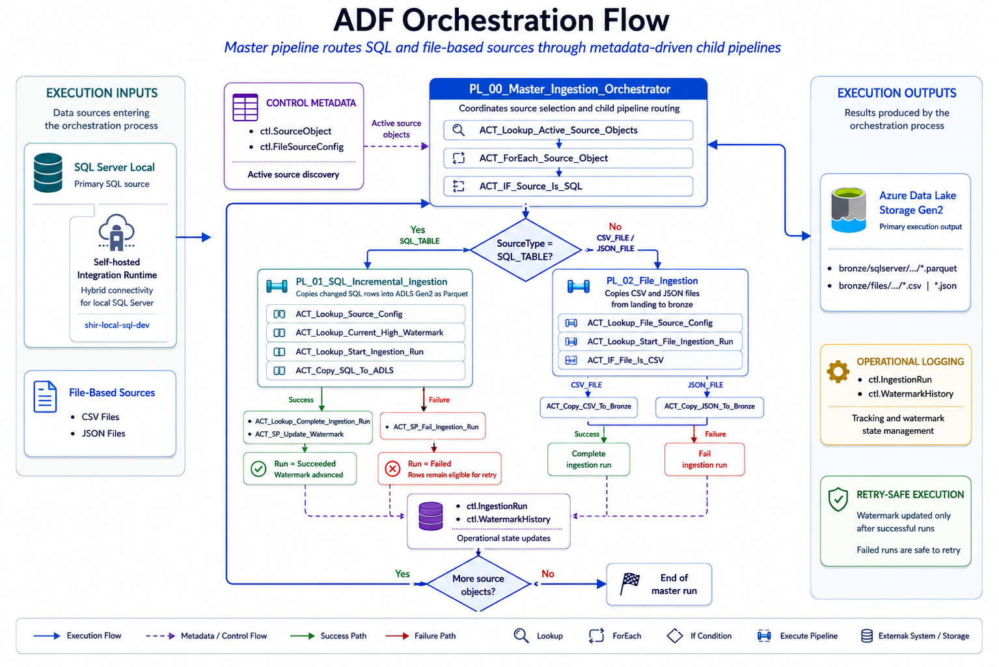

# ADF Pipeline Design

## Project

`azure-adf-incremental-ingestion-framework`

## Purpose

This document describes the Azure Data Factory pipeline design used by the incremental ingestion framework.

The implementation uses a master/child pipeline pattern to orchestrate multiple source types:

- SQL Server tables
- CSV files
- JSON files

The design is metadata-driven and uses control tables, dynamic datasets, pipeline parameters, stored procedures, watermarks, and operational logging.

---

## Pipeline Inventory

| Pipeline | Purpose |
|---|---|
| `PL_00_Master_Ingestion_Orchestrator` | Reads active source objects and routes execution to the correct child pipeline. |
| `PL_01_SQL_Incremental_Ingestion` | Performs incremental SQL Server extraction into ADLS Gen2 using a datetime watermark. |
| `PL_02_File_Ingestion` | Copies CSV and JSON files from ADLS `landing` into ADLS `bronze`. |

---

## High-Level Pipeline Flow



## 1. Master Orchestrator Pipeline

### Pipeline

`PL_00_Master_Ingestion_Orchestrator`

### Responsibility

The master pipeline controls the execution of the ingestion framework.

It reads active source objects from the control metadata layer and routes each object to the correct ingestion pipeline based on SourceType.

### Parameters

| Parameter | Type | Purpose |
|-----------|------|---------|
| `RunMode` | String | Controls whether the master runs SQL sources, file sources, or all sources. |
| `SourceSystemName` | String | Optional filter for a specific source system. |

### Main Activities
| Activity | Type | Purpose |
|----------|------|---------|
| `ACT_Lookup_Active_Source_Objects` | Lookup | Reads active source objects from ctl.SourceObject. |
| `ACT_ForEach_Source_Object` | ForEach | Iterates through each active source object. |
| `ACT_IF_Source_Is_SQL` | If Condition | Routes execution based on whether SourceType = `SQL_TABLE`. |
| `ACT_Execute_SQL_Ingestion` | Execute Pipeline | Calls `PL_01_SQL_Incremental_Ingestion`. |
| `ACT_Execute_File_Ingestion` | Execute Pipeline | Calls `PL_02_File_Ingestion`. |

### Routing Logic
```text 
If SourceType = SQL_TABLE:
    Execute PL_01_SQL_Incremental_Ingestion
Else:
    Execute PL_02_File_Ingestion
```

Validated modes:

| Run Mode | Result |
|----------|--------|
| `FILES_ONLY` | Successfully routed CSV and JSON sources to `PL_02_File_Ingestion`.|
| `SQL_ONLY` | Successfully routed SQL Server tables to `PL_01_SQL_Incremental_Ingestion`. |


## 2. SQL Incremental Ingestion Pipeline

### Pipeline

`PL_01_SQL_Incremental_Ingestion`

### Responsibility

This pipeline performs incremental extraction from SQL Server local tables into ADLS Gen2 Parquet files.

It uses a datetime watermark based on the UpdatedAt column.

### Parameters

| Parameter | Type | Purpose |
|-----------|------|---------|
| `SourceObjectId` | Integer | Identifies the source object to process. |
| `PipelineRunId` | String | Groups related execution logs under a logical run ID. |

### Main Activities
| Activity | Type | Purpose |
|----------|------|---------|
| `ACT_Lookup_Source_Config` | Lookup | Reads source configuration from control metadata. |
| `ACT_Lookup_Current_High_Watermark` |Lookup | Captures the current source high watermark before extraction. |
| `ACT_Lookup_Start_Ingestion_Run` | Lookup | Creates a `Started` run record in `ctl.IngestionRun`. |
| `ACT_Copy_SQL_To_ADLS` | Copy Activity | Copies incremental SQL rows to ADLS Gen2 as Parquet. |
| `ACT_Lookup_Complete_Ingestion_Run` | Lookup | Marks the ingestion run as completed and stores row counts/output path. |
| `ACT_SP_Update_Watermark` | Stored Procedure | Updates the stored watermark and writes watermark history. |
| `ACT_SP_Fail_Ingestion_Run` | Stored Procedure | Logs a failed ingestion run if the copy activity fails. |

### Incremental Extraction Logic

The SQL extraction window follows this pattern:

```sql
WHERE UpdatedAt > @LastWatermarkValue
  AND UpdatedAt <= @CurrentHighWatermarkValue
```

### Success Path
```text
Lookup source config
→ Lookup current high watermark
→ Start ingestion run
→ Copy SQL to ADLS
→ Complete ingestion run
→ Update watermark
```

### Failure Path
```text 
Copy SQL to ADLS fails
→ Fail ingestion run
→ Do not update watermark
→ Do not insert WatermarkHistory
→ Leave source row eligible for retry
```

### Output Pattern

SQL outputs are written to ADLS Gen2 under:

```text 
bronze/sqlserver/<source_system>/<schema>/<table>/load_date=YYYY-MM-DD/run_id=<run_id>/<table>.parquet
```

Example:

```text 
bronze/sqlserver/sales_local/dbo/orders/load_date=2026-05-15/run_id=<guid>/orders.parquet
```

## 3. File Ingestion Pipeline

## Pipeline

`PL_02_File_Ingestion`

### Responsibility

This pipeline copies file-based sources from ADLS Gen2 landing to ADLS Gen2 bronze.

Supported source types:

* `CSV_FILE`
* `JSON_FILE`
  
### Parameters
| Parameter | Type | Purpose |
|-----------|------|---------|
| `SourceObjectId` | Integer | Identifies the file source object to process. |
| `PipelineRunId` | String | Groups related execution logs under a logical run ID. |

### Main Activities
| Activity | Type | Purpose |
|----------|------|---------|
| `ACT_Lookup_File_Source_Config` | Lookup | Reads file source configuration from control metadata. |
`ACT_Lookup_Start_File_Ingestion_Run` | Lookup | Creates a `Started` run record in `ctl.IngestionRun`. |
`ACT_IF_File_Is_CSV` | If Condition | Routes file execution based on `SourceType`. |
`ACT_Copy_CSV_To_Bronze` | Copy Activity | Copies CSV file sources from `landing` to `bronze`. |
`ACT_Copy_JSON_To_Bronze` | Copy Activity | Copies JSON file sources from landing to bronze. |
`ACT_Lookup_Complete_CSV_Ingestion_Run` | Lookup | Marks CSV ingestion as completed. |
`ACT_Lookup_Complete_JSON_Ingestion_Run` | Lookup | Marks JSON ingestion as completed. |
`ACT_SP_Fail_CSV_Ingestion_Run` | Stored Procedure | Logs a failed CSV ingestion run. |
`ACT_SP_Fail_JSON_Ingestion_Run` | Stored Procedure |	Logs a failed JSON ingestion run. |

### File Routing Logic

```text
If SourceType = CSV_FILE:
    Copy using DS_ADLS_CSV_DYNAMIC

If SourceType = JSON_FILE:
    Copy using DS_ADLS_JSON_DYNAMIC
```

### Output Pattern

File outputs are copied to:

```text 
bronze/files/<format>/<file_object>/load_date=YYYY-MM-DD/run_id=<run_id>/<file_name>
```

Example:

```text 
bronze/files/json/source_system_metadata/load_date=2026-05-15/run_id=<guid>/source_system_metadata.json
```

## 4. Metadata-Driven Design

The framework avoids hardcoding source objects directly into the pipelines.

Instead, source behavior is driven by control metadata.

Key metadata values include:

| Metadata	| Purpose |
|-----------|---------|
| `SourceObjectId` | Identifies the source object to process. |
`SourceSystemName` |Groups source objects by source system. |
`SourceType` | Determines whether the object is SQL, CSV, or JSON. |
`SourceSchema` | SQL schema for SQL sources.|
`SourceObjectName` | SQL table or file object name. |
`WatermarkColumn` | Column used for incremental SQL extraction. |
`LastWatermarkValue` | Last successfully processed watermark. |
`DestinationContainer` | ADLS target container.|
`DestinationFolder`	| ADLS target folder path. |
`DestinationFormat`	| Output format such as Parquet, CSV, or JSON. |

## 5. Dynamic Dataset Strategy

The pipelines use parameterized datasets to avoid creating one dataset per source object.

| Dataset | Used By | Purpose |
|---------|---------|---------|
| `DS_SQLSERVER_TABLE_DYNAMIC` | SQL lookups and SQL copy source | Dynamic SQL Server object access. |
| `DS_ADLS_PARQUET_DYNAMIC`	SQL copy sink | Dynamic Parquet output paths. |
| `DS_ADLS_CSV_DYNAMIC`	| File ingestion | Dynamic CSV source and sink paths. |
| `DS_ADLS_JSON_DYNAMIC` | File ingestion | Dynamic JSON source and sink paths. |

## 6. Operational Logging

The framework logs ingestion runs in:

```text 
ctl.IngestionRun
```

Important logged values include:

* `PipelineRunId`
* `RunId`
* `SourceObjectName`
* `SourceType`
* `Status`
* `OldWatermarkValue`
* `CurrentHighWatermarkValue`
* `NewWatermarkValue`
* `RowsRead`
* `RowsCopied`
* `DestinationContainer`
* `DestinationFolder`
* `ErrorMessage`
* `StartedAt`
* `EndedAt`

Watermark movement is recorded in:

```text
ctl.WatermarkHistory
```

Only successful SQL ingestion runs update the stored watermark and create watermark history records.

## 7. Validated Scenarios

The pipeline design was validated through:

| Scenario | Result |
|----------|--------|
| SQL incremental copy to ADLS Parquet | Passed |
| SQL pipeline complete and watermark update | Passed |
| SQL failure path configured | Passed |
| CSV file ingestion | Passed |
| JSON file ingestion | Passed |
| Master orchestrator FILES_ONLY route | Passed |
| Master orchestrator SQL_ONLY route | Passed |
| Incremental insert | Passed |
| Incremental update | Passed |
| Refund scenario | Passed |
| Empty run validation | Passed |
| Controlled failed run | Passed |
| Retry after failure | Passed |
| Final operational validation summary | Passed |

## 8. Design Value

This pipeline design demonstrates:

* Master/child orchestration
* Metadata-driven routing
* Dynamic datasets
* Parameterized paths
* Incremental extraction
* Watermark governance
* Operational logging
* Failure-safe processing
* Retry readiness
* Multi-source ingestion
* ADLS Gen2 landing and bronze organization

The result is a practical ingestion framework aligned with real-world Azure Data Engineering patterns.