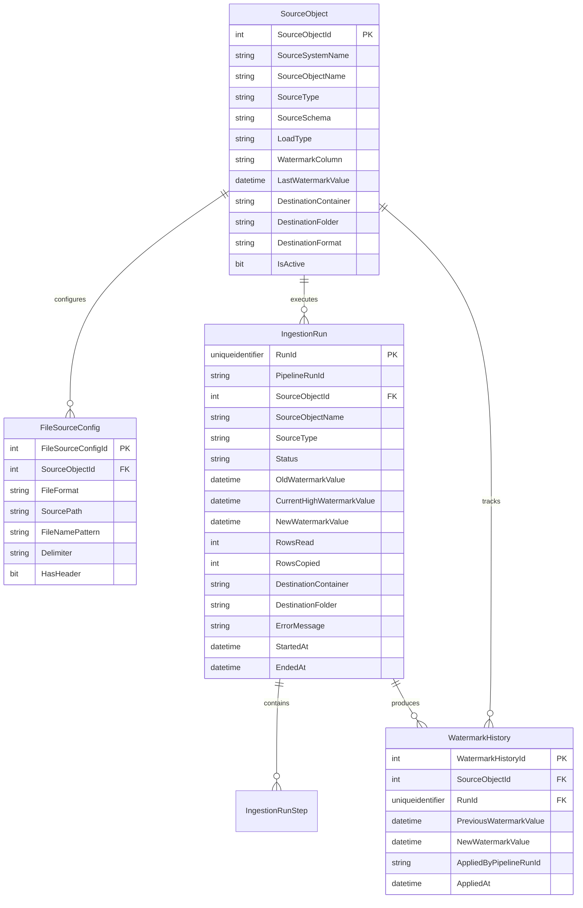
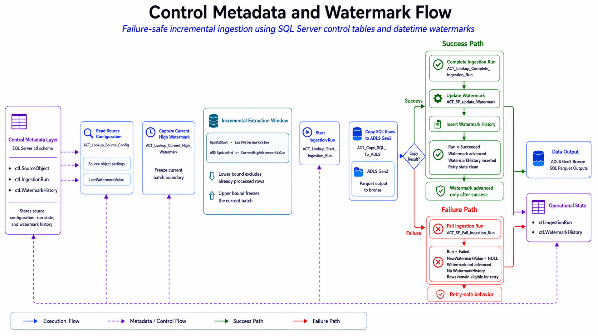

# Control Metadata Design

## Project

`azure-adf-incremental-ingestion-framework`

## Purpose

This document describes the control metadata layer used by the ADF Incremental Ingestion Framework.

The control metadata layer allows Azure Data Factory pipelines to run in a metadata-driven way instead of hardcoding source tables, file names, destination folders, watermarks, and execution state directly inside the pipelines.

The control metadata layer supports:

- Source object discovery
- SQL and file source configuration
- Incremental watermark tracking
- Ingestion run logging
- Failure logging
- Retry readiness
- Operational validation
- Evidence-based troubleshooting

---

## Control Schema

The framework uses a dedicated SQL Server schema:

```sql
ctl
```

The `ctl` schema separates operational metadata from source business data.

Source data lives under user / application schemas:

```sql
dbo
```

Control metadata lives under:

```sql
ctl
```

---

## Control Metadata Tables

The framework uses the following control tables:

| Table | Purpose |
|---|---|
| `ctl.SourceObject` | Defines every source object that can be processed by ADF. |
| `ctl.FileSourceConfig` | Stores file-specific settings for CSV and JSON ingestion. |
| `ctl.IngestionRun` | Stores ingestion execution history and operational status. |
| `ctl.IngestionRunStep` | Stores optional step-level execution details. |
| `ctl.WatermarkHistory` | Stores historical watermark movement for successful SQL ingestion runs. |

---

## Logical Model



---

## 1. `ctl.SourceObject`

### Purpose

`ctl.SourceObject` is the central metadata table of the framework.

It defines which source objects are active, how they should be processed, where their outputs should land, and what watermark value was last successfully processed.

### Example Source Types

| SourceType | Description |
|---|---|
| `SQL_TABLE` | SQL Server table processed through incremental extraction. |
| `CSV_FILE` | CSV file copied from ADLS `landing` to `bronze`. |
| `JSON_FILE` | JSON file copied from ADLS `landing` to `bronze`. |

### Example SQL Source Objects

```text
Customers
Products
Orders
OrderItems
Payments
```

### Example File Source Objects

```text
currency_rates
country_currency
source_system_metadata
manual_adjustments
```

### Key Columns

| Column | Purpose |
|---|---|
| `SourceObjectId` | Surrogate identifier used by ADF pipeline parameters. |
| `SourceSystemName` | Logical source system name, such as `sales_local` or `reference_files`. |
| `SourceObjectName` | Table name or logical file object name. |
| `SourceType` | Determines whether the object is routed to SQL or file ingestion. |
| `SourceSchema` | SQL schema for SQL table sources. |
| `LoadType` | Indicates ingestion mode, such as `INCREMENTAL`. |
| `WatermarkColumn` | Column used for incremental SQL extraction. |
| `LastWatermarkValue` | Last successfully processed watermark. |
| `DestinationContainer` | ADLS Gen2 target container. |
| `DestinationFolder` | ADLS Gen2 target folder. |
| `DestinationFormat` | Output format such as `PARQUET`, `CSV`, or `JSON`. |
| `IsActive` | Controls whether the object is included by the master orchestrator. |

---

## 2. `ctl.FileSourceConfig`

### Purpose

`ctl.FileSourceConfig` stores file-specific settings for source objects whose type is `CSV_FILE` or `JSON_FILE`.

This avoids hardcoding file paths, file names, delimiters, and format behavior directly inside ADF pipelines.

### Key Columns

| Column | Purpose |
|---|---|
| `FileSourceConfigId` | Surrogate identifier for the file configuration record. |
| `SourceObjectId` | Links the file configuration to `ctl.SourceObject`. |
| `FileFormat` | File format such as `CSV` or `JSON`. |
| `SourcePath` | Source folder under ADLS `landing`. |
| `FileNamePattern` | Expected file name or pattern. |
| `Delimiter` | CSV delimiter when applicable. |
| `HasHeader` | Indicates whether CSV files include a header row. |

### Example

```text
SourceObjectName: currency_rates
SourceType: CSV_FILE
SourcePath: landing/files/csv/currency_rates
FileNamePattern: currency_rates*.csv
DestinationFolder: files/csv/currency_rates
```

---

## 3. `ctl.IngestionRun`

### Purpose

`ctl.IngestionRun` is the main operational logging table.

Every ingestion attempt creates a run record. The record tracks whether the run started, succeeded, or failed.

This table is used for:

- Execution traceability
- Row count validation
- Watermark validation
- Failure analysis
- Retry analysis
- Evidence screenshots

### Status Values

| Status | Meaning |
|---|---|
| `Started` | The ingestion run was registered before data movement started. |
| `Succeeded` | The ingestion run completed successfully. |
| `Failed` | The ingestion run failed and did not advance the watermark. |

### Key Columns

| Column | Purpose |
|---|---|
| `RunId` | Unique run identifier generated by the control layer. |
| `PipelineRunId` | Logical run ID passed from ADF. |
| `SourceObjectId` | Source object processed. |
| `SourceObjectName` | Source object name captured for easier evidence review. |
| `SourceType` | Source type captured for reporting and troubleshooting. |
| `Status` | Current run status. |
| `OldWatermarkValue` | Watermark value before the run. |
| `CurrentHighWatermarkValue` | High watermark captured before extraction. |
| `NewWatermarkValue` | Watermark value applied after successful processing. |
| `RowsRead` | Rows read by the SQL Copy Activity when available. |
| `RowsCopied` | Rows copied by the SQL Copy Activity when available. |
| `DestinationContainer` | ADLS target container. |
| `DestinationFolder` | ADLS target folder generated for the run. |
| `ErrorMessage` | Error message captured for failed runs. |
| `StartedAt` | Run start timestamp. |
| `EndedAt` | Run completion or failure timestamp. |

---

## 4. `ctl.IngestionRunStep`

### Purpose

`ctl.IngestionRunStep` is intended for step-level logging.

The MVP focuses mainly on `ctl.IngestionRun`, but this table provides a foundation for more detailed operational telemetry.

Potential future uses include:

- Logging each ADF activity
- Capturing step start/end timestamps
- Recording step-specific errors
- Recording source-to-target metrics
- Supporting deeper monitoring reports

---

## 5. `ctl.WatermarkHistory`

### Purpose

`ctl.WatermarkHistory` stores historical watermark movement.

A record is inserted only after a successful SQL ingestion run updates the source object's stored watermark.

This table is critical because it proves that watermarks advance only after successful ingestion.

### Key Columns

| Column | Purpose |
|---|---|
| `WatermarkHistoryId` | Surrogate identifier for the history record. |
| `SourceObjectId` | Source object whose watermark changed. |
| `RunId` | Ingestion run that applied the watermark update. |
| `PreviousWatermarkValue` | Watermark before the successful run. |
| `NewWatermarkValue` | Watermark after the successful run. |
| `AppliedByPipelineRunId` | Logical ADF pipeline run that applied the change. |
| `AppliedAt` | Timestamp when the watermark update was recorded. |

---

## Stored Procedure Interface

ADF interacts with the control metadata layer through stored procedures.

| Stored Procedure | Purpose |
|---|---|
| `ctl.usp_GetActiveSourceObjects` | Returns active source objects for the master orchestrator. |
| `ctl.usp_GetSourceObjectConfig` | Returns configuration for a specific source object. |
| `ctl.usp_GetCurrentHighWatermark` | Captures the current high watermark from the source table. |
| `ctl.usp_StartIngestionRun` | Creates a `Started` ingestion run record. |
| `ctl.usp_CompleteIngestionRun` | Marks an ingestion run as `Succeeded` and stores output metrics. |
| `ctl.usp_FailIngestionRun` | Marks an ingestion run as `Failed` and stores the error message. |
| `ctl.usp_UpdateWatermark` | Updates `ctl.SourceObject.LastWatermarkValue` and inserts `ctl.WatermarkHistory`. |
| `ctl.usp_LogIngestionRunStep` | Supports optional step-level logging. |

---

## Metadata-Driven Orchestration Flow

### Master Orchestrator

The master pipeline calls:

```sql
ctl.usp_GetActiveSourceObjects
```

This returns active source objects based on parameters such as:

```text
RunMode
SourceSystemName
```

ADF then routes each object based on `SourceType`.

### SQL Ingestion Flow

For SQL sources, ADF uses the control layer in this sequence:

```text
1. Get source object configuration
2. Get current high watermark
3. Start ingestion run
4. Copy incremental rows to ADLS
5. Complete ingestion run
6. Update stored watermark
7. Insert watermark history
```

### File Ingestion Flow

For file sources, ADF uses the control layer in this sequence:

```text
1. Get file source configuration
2. Start ingestion run
3. Copy CSV or JSON file from landing to bronze
4. Complete ingestion run
```

File ingestion does not update SQL table watermarks.

---

## Watermark Governance Rules



The framework follows these rules:

| Rule | Description |
|---|---|
| Capture high watermark before copy | Prevents chasing moving source data during extraction. |
| Copy using a closed extraction window | Uses `UpdatedAt > LastWatermarkValue` and `UpdatedAt <= CurrentHighWatermarkValue`. |
| Update watermark only after success | Prevents data loss when a run fails. |
| Do not write history for failed runs | Keeps watermark history tied to successful state changes only. |
| Keep rows eligible after failure | Allows a later retry to process the same pending changes. |
| Track each source independently | Each SQL table has its own watermark state. |

---

## Failure Handling Behavior

When a SQL copy fails:

```text
ACT_Copy_SQL_To_ADLS
    -> Failure path
    -> ACT_SP_Fail_Ingestion_Run
```

The failed run is recorded in `ctl.IngestionRun`.

Expected failed-run behavior:

| Field | Expected Value |
|---|---|
| `Status` | `Failed` |
| `NewWatermarkValue` | `NULL` |
| `WatermarkHistory` | No record for the failed run |
| Source row eligibility | Rows remain eligible for retry |

This behavior was validated through the controlled failed run and retry scenario.

---

## Retry Behavior

After a failed run, the framework can be retried because the watermark was not advanced.

Retry behavior:

1. Restore valid destination configuration.
2. Execute the SQL ingestion pipeline again.
3. The same pending rows remain eligible.
4. The copy succeeds.
5. The watermark advances.
6. `ctl.WatermarkHistory` records the successful retry.

---

## Operational Evidence Supported by Control Metadata

The control metadata layer supports evidence for:

| Evidence Area | Control Metadata Used |
|---|---|
| Initial ingestion | `ctl.IngestionRun`, `ctl.SourceObject`, `ctl.WatermarkHistory` |
| Incremental insert | `RowsRead`, `RowsCopied`, watermark movement |
| Incremental update | `RowsRead`, `RowsCopied`, updated business rows |
| Refund scenario | Independent watermark movement for Orders and Payments |
| Empty run validation | No eligible rows compared to current watermarks |
| Controlled failure | Failed status with no watermark update |
| Retry after failure | Successful retry with watermark advancement |
| Final validation summary | Aggregated scenario results from control tables |

---

## Design Value

The control metadata design provides:

- Reusable source configuration
- Metadata-driven orchestration
- Independent watermark state per source object
- Auditable ingestion history
- Failure-safe state management
- Retry readiness
- Evidence-friendly validation queries
- A foundation for future monitoring and operational reporting

This design keeps the ADF pipelines cleaner and moves operational state management into a structured SQL control layer.