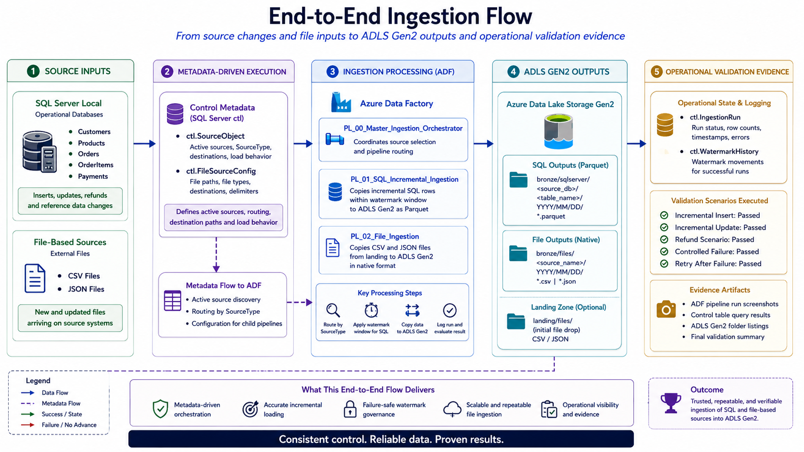

# Operational Validation

## Project

`azure-adf-incremental-ingestion-framework`

## Purpose

This document describes the operational validation performed for the ADF Incremental Ingestion Framework.

The goal of operational validation is to prove that the framework works end-to-end and behaves correctly under normal, incremental, empty, failed, and retry scenarios.

The validation focuses on:

- SQL incremental ingestion
- CSV file ingestion
- JSON file ingestion
- Master orchestration
- Control metadata updates
- Watermark advancement
- Failure handling
- Retry readiness
- Final scenario summary

---

## Validation Scope

The project validated the following operational areas:

| Area | Validation Goal |
|---|---|
| SQL ingestion | Confirm SQL Server rows are copied incrementally into ADLS Gen2 as Parquet. |
| File ingestion | Confirm CSV and JSON files are copied from `landing` to `bronze`. |
| Master orchestration | Confirm SQL and file sources are routed to the correct child pipelines. |
| Watermark updates | Confirm watermarks advance only after successful SQL ingestion. |
| Failure behavior | Confirm failed runs do not advance watermarks. |
| Retry behavior | Confirm pending rows remain eligible and can be processed after failure recovery. |
| Final summary | Confirm all major scenarios passed. |

---

## Validation Evidence Strategy

Evidence was captured during implementation and validation.

The evidence includes:

- ADF pipeline run screenshots
- Copy Activity output metrics
- SQL Server control table resultsets
- ADLS output screenshots
- Scenario validation queries
- Final operational summary

The selected evidence is listed in:

```text
docs/evidence/evidence_index.md
```

Screenshots are stored in:

```text
docs/evidence/screenshots/
```

---

## Master Orchestrator Validation

### Pipeline

```text
PL_00_Master_Ingestion_Orchestrator
```

### Validated Modes

The master pipeline was validated using separate execution modes:

| Mode | Purpose | Result |
|---|---|---|
| `FILES_ONLY` | Validate routing to file ingestion pipeline. | Passed |
| `SQL_ONLY` | Validate routing to SQL incremental ingestion pipeline. | Passed |

### Why Separate Modes Were Used

The master orchestrator supports both SQL and file routing.

Separate evidence was captured for `FILES_ONLY` and `SQL_ONLY` because it makes the screenshots easier to review.

This avoids a noisy `ALL` execution screenshot while still proving both routing paths.

### Evidence

| Evidence | Description |
|---|---|
| `53_master_orchestrator_files_success.png` | Master successfully routed file sources to `PL_02_File_Ingestion`. |
| `54_master_orchestrator_sql_success.png` | Master successfully routed SQL sources to `PL_01_SQL_Incremental_Ingestion`. |
| `55_operational_control_summary_after_master.png` | Control metadata summary after master orchestrator execution. |

---

## SQL Ingestion Validation

### Pipeline

```text
PL_01_SQL_Incremental_Ingestion
```

### Validation Goal

Confirm that SQL Server source rows are copied to ADLS Gen2 as Parquet and that the control metadata layer is updated correctly.

### SQL Source Tables

```text
dbo.Customers
dbo.Products
dbo.Orders
dbo.OrderItems
dbo.Payments
```

### Expected Behavior

For a successful SQL ingestion run:

1. A run is created in `ctl.IngestionRun`.
2. Rows are copied to ADLS Gen2 as Parquet.
3. The run is marked as `Succeeded`.
4. `RowsRead` and `RowsCopied` are recorded.
5. `ctl.SourceObject.LastWatermarkValue` is updated.
6. `ctl.WatermarkHistory` receives a new record.

### Evidence

| Evidence | Description |
|---|---|
| `48_sql_copy_to_adls_success.png` | SQL Server to ADLS Gen2 Parquet copy succeeded. |
| `49_sql_pipeline_complete_and_watermark_success.png` | SQL pipeline completed successfully and watermark advanced. |

---

## File Ingestion Validation

### Pipeline

```text
PL_02_File_Ingestion
```

### Validation Goal

Confirm that CSV and JSON files are copied from ADLS Gen2 `landing` into ADLS Gen2 `bronze`.

### File Sources

CSV sources:

```text
currency_rates.csv
country_currency.csv
```

JSON sources:

```text
source_system_metadata.json
manual_adjustments.json
```

### Expected Behavior

For a successful file ingestion run:

1. File source configuration is read from control metadata.
2. A run is created in `ctl.IngestionRun`.
3. The pipeline routes to CSV or JSON branch based on `SourceType`.
4. The file is copied from `landing` to `bronze`.
5. The run is marked as `Succeeded`.
6. Destination container and folder are recorded.

### Evidence

| Evidence | Description |
|---|---|
| `51_file_pipeline_csv_copy_and_control_success.png` | CSV file ingestion succeeded with control metadata validation. |
| `52_file_pipeline_json_copy_and_control_success.png` | JSON file ingestion succeeded with control metadata validation. |

---

## Control Metadata Validation



The framework uses SQL Server control metadata to validate operational behavior.

Important control tables:

| Table | Validation Role |
|---|---|
| `ctl.SourceObject` | Stores source configuration and current watermark values. |
| `ctl.IngestionRun` | Stores run status, rows copied, destination folders, and errors. |
| `ctl.WatermarkHistory` | Stores watermark movement for successful SQL ingestion runs. |

### Operational Summary After Master

The post-master validation confirmed:

| Source Type | Expected Result |
|---|---|
| `CSV_FILE` | 2 successful runs |
| `JSON_FILE` | 2 successful runs |
| `SQL_TABLE` | 5 successful runs |

### Evidence

```text
55_operational_control_summary_after_master.png
```

---

## Incremental Insert Validation

### Goal

Validate that newly inserted records are captured by the incremental ingestion framework.

### Expected Source Changes

| Source Object | Expected Rows |
|---|---:|
| `Customers` | 1 |
| `Orders` | 1 |
| `OrderItems` | 2 |
| `Payments` | 1 |

### Expected Ingestion Result

| Source Object | Expected RowsCopied |
|---|---:|
| `Customers` | 1 |
| `Orders` | 1 |
| `OrderItems` | 2 |
| `Payments` | 1 |

### Evidence

| Evidence | Description |
|---|---|
| `56_incremental_insert_source_changes_created.png` | Source changes for the incremental insert scenario were created. |
| `57_incremental_insert_ingestion_success.png` | Incremental insert ingestion succeeded with expected rows copied. |

---

## Incremental Update Validation

### Goal

Validate that updates to existing records are captured by the incremental ingestion framework.

### Expected Source Changes

| Source Object | Expected Rows |
|---|---:|
| `Customers` | 1 |
| `Products` | 1 |
| `Orders` | 1 |
| `Payments` | 1 |

### Expected Ingestion Result

| Source Object | Expected RowsCopied |
|---|---:|
| `Customers` | 1 |
| `Products` | 1 |
| `Orders` | 1 |
| `Payments` | 1 |

### Evidence

| Evidence | Description |
|---|---|
| `59_incremental_update_ingestion_success.png` | Incremental update ingestion succeeded with expected rows copied and updated business values. |

---

## Refund Scenario Validation

### Goal

Validate a business change that affects related source tables.

The refund scenario updates:

```text
dbo.Orders
dbo.Payments
```

Expected business state:

```text
Orders.OrderStatus     = REFUNDED
Payments.PaymentStatus = REFUNDED
```

### Expected Ingestion Result

| Source Object | Expected RowsCopied |
|---|---:|
| `Orders` | 1 |
| `Payments` | 1 |

### Evidence

| Evidence | Description |
|---|---|
| `60_refund_source_changes_created.png` | Refund source changes were created. |
| `61_refund_ingestion_success.png` | Refund ingestion succeeded and watermarks advanced correctly. |

---

## Empty Run Validation

### Goal

Validate that after processing all pending changes, no rows remain eligible for ingestion.

### Expected Result

For all SQL source tables:

```text
Eligible_Row_Count = 0
Validation_Status  = PASS_EMPTY_READY
```

### Meaning

This confirms that:

```text
MAX(UpdatedAt) <= LastWatermarkValue
```

for each SQL source object.

### Evidence

| Evidence | Description |
|---|---|
| `62_empty_run_validation_success.png` | Empty-run readiness validation passed with zero eligible rows. |

---

## Controlled Failed Run Validation

### Goal

Validate that a failed SQL ingestion run does not advance the watermark.

### Failure Method

A controlled failure was created by temporarily changing the destination configuration for the `Orders` source object to an invalid ADLS container.

This caused the SQL copy activity to fail as expected.

### Expected Failed Behavior

| Validation Point | Expected Result |
|---|---|
| Run status | `Failed` |
| `NewWatermarkValue` | `NULL` |
| `WatermarkHistory_Count` | `0` |
| Pending rows after failure | Greater than `0` |
| Retry eligibility | Preserved |

### Evidence

| Evidence | Description |
|---|---|
| `63_failed_run_pending_order_change_created.png` | Pending Orders change was created before the failure test. |
| `64_controlled_failed_run_validation.png` | Failed run was logged and watermark did not advance. |

---

## Retry After Failure Validation

### Goal

Validate that a row left pending after a failed run can be processed successfully after the issue is corrected.

### Retry Flow

1. A pending `Orders` row was created.
2. The controlled failure prevented successful copy.
3. The failed run was logged.
4. The watermark did not advance.
5. The destination configuration was restored.
6. The SQL ingestion pipeline was executed again.
7. The pending row was copied successfully.
8. The watermark advanced after the successful retry.

### Expected Retry Result

| Field | Expected Result |
|---|---|
| `Status` | `Succeeded` |
| `RowsRead` | 1 |
| `RowsCopied` | 1 |
| `WatermarkHistory` | 1 record for the successful retry |
| `LastWatermarkValue` | Advanced to the retried row `UpdatedAt` |

### Evidence

| Evidence | Description |
|---|---|
| `65_retry_after_failure_success.png` | Retry after failure succeeded and watermark advanced correctly. |

---

## Final Operational Validation Summary

### Goal

Create a compact final summary showing the outcome of the major validation scenarios.

### Validated Scenarios

| Scenario | Result |
|---|---|
| Incremental Insert | PASS |
| Incremental Update | PASS |
| Refund Scenario | PASS |
| Controlled Failed Run | PASS |
| Retry After Failure | PASS |

The final failed-run safety check also confirmed:

```text
PASS_FAILED_RUN_DID_NOT_ADVANCE_WATERMARK
```

### Evidence

| Evidence | Description |
|---|---|
| `66_operational_validation_final_summary.png` | Final validation summary across all major operational scenarios. |

---

## Validation Results Summary

| Validation Area | Result |
|---|---|
| SQL incremental ingestion | Passed |
| CSV file ingestion | Passed |
| JSON file ingestion | Passed |
| Master orchestrator file routing | Passed |
| Master orchestrator SQL routing | Passed |
| Incremental insert | Passed |
| Incremental update | Passed |
| Refund scenario | Passed |
| Empty run readiness | Passed |
| Controlled failed run | Passed |
| Retry after failure | Passed |
| Final operational validation summary | Passed |

---

## Operational Lessons Learned

Key lessons from validation:

| Lesson | Explanation |
|---|---|
| Watermark updates must happen only after successful copy | Prevents data loss after failures. |
| Lookup is better for reading results, Stored Procedure activity is better for write/update actions | Reduced issues with operational stored procedures. |
| Dynamic datasets may fail preview when paths do not exist yet | Runtime validation is more meaningful for dynamic sinks. |
| SHIR may require local dependencies for Parquet operations | Java Runtime was required for Parquet copy through SHIR. |
| File copy output metrics differ from SQL copy metrics | File copies expose file and byte metrics rather than row counts. |
| Evidence should be compact and scoped | Focused screenshots communicate better than noisy full logs. |

---

## Design Value

The operational validation proves that the framework is not only structurally complete, but functionally reliable across important ingestion scenarios.

It demonstrates:

- Working SQL incremental ingestion
- Working file ingestion
- Master orchestration
- Independent watermarks
- Control table logging
- Failure-safe behavior
- Retry readiness
- Evidence-supported results

This strengthens the project as a professional Azure Data Engineering portfolio artifact.